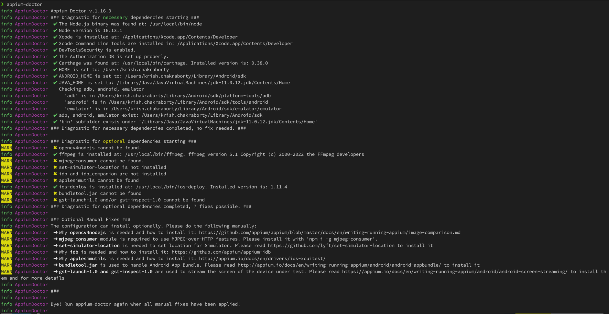
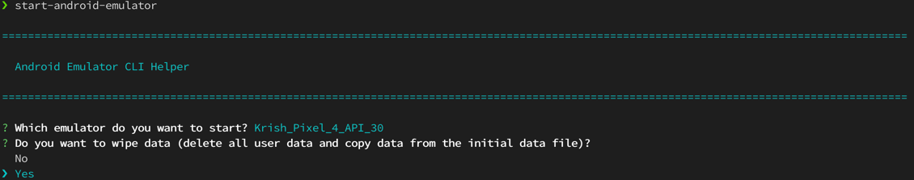

# Appium Starter-kit for Android and iOS

## About

- This framework provides a basic implementation for Appium based Android/ iOS tests
- This could be used as the initial starter-kit to evolve into a full-fledged framework


## Set-up steps on Mac

- Install Homebrew

`/bin/bash -c "$(curl -fsSL https://raw.githubusercontent.com/Homebrew/install/HEAD/install.sh)”`

Check brew version: `brew --version`

- Install node and npm


  `brew install node`

  
   Check node version: `node -v`
        
   Check npm version: `npm -v`

- Install Appium 2.x
`npm install -g appium@next`

Note: This does not install any driver or plugin by default


- Install WebDriver

`npm install wd`

- Install XCUITest driver for iOS

`appium driver install xcuitest`

- Install UIAutomator2 driver for Android

`appium driver install uiautomator2`

- View the list of drivers installed

`appium driver list --installed`

Note: To view all the drivers (installed and not-installed)

`appium driver list`

- To start the Appium server

`appium`

- Install and set up the JAVA Path in bash_profile

- To verify the dependencies that are missing as well as how to install them, install Appium doctor CLI tool using the below command

`npm install -g appium-doctor`

- Run Appium doctor to verify for both Android and iOS

`appium-doctor`



For only Android

`appium-doctor --android`

For only iOS

`appium-doctor --ios`

- Set the Android path (Example: `open -t ~/.bash_profile`, set the path as below, save, close the window and then `source ~/.bash_profile`)

export ANDROID_HOME=/Users/YourUserName/Library/Android/sdk

export PATH=$ANDROID_HOME/emulator:$PATH

export PATH=$ANDROID_HOME/tools:$PATH

export PATH=$ANDROID_HOME/tools/bin:$PATH

export PATH=$ANDROID_HOME/platform-tools:$PATH

- Install adb

`brew install wget`

`wget https://dl.google.com/android/repository/platform-tools-latest-darwin.zip`

Unzip the platform tools folder and set the path to adb in your bash profile or zshrc (based on your machine's shell), as below:

export /Users/YourUserName/AndroidSetup/platform-tools/adb

- Verify whether adb (android debug bridge) is installed and display the list of devices

`./adb devices`

- Install Carthage

`brew install carthage`

- Install webpack

`npm i -g webpack`

- Download and install Appium Inspector GUI

- Install libimobiledevice (A library to communicate with services on iOS devices using native protocols.)

`brew install libimobiledevice`

- Install XCODE for iOS simulators from App Store

`npm install -g authorize-ios` (Not needed now)

- Install iOS-deploy (Install and debug iOS apps from the command line)

`brew install ios-deploy`

- Install ideviceinstaller

`brew install ideviceinstaller`

- Install iOS webkit 

`brew install ios-webkit-debug-proxy`

- To start android emulator, first install

`npm install -g start-android-emulator`

and then run,

`start-android-emulator`



## Run Android tests

```zsh
gradle wrapper clean build runTests -Dtag="ANDROID" -Ddevice="ANDROID"
```

## Run iOS tests
```zsh
gradle wrapper clean build runTests -Dtag="IOS" -Dtarget="IOS"
```

